# Lab 1: Understanding Blockchain Explorers

## Overview
In this lab, you'll learn how to use Etherscan, the most popular blockchain explorer for Ethereum. We'll explore how to track transactions, analyze wallet addresses, examine smart contracts, and understand network metrics - all essential skills for navigating the DeFi ecosystem.

## Prerequisites
- A computer with internet access
- A web browser

## Steps

### Step 1: Accessing Etherscan
Visit [Etherscan.io](https://etherscan.io/) in your browser. The homepage provides an overview of the Ethereum blockchain, including recent blocks, transactions, and network statistics.

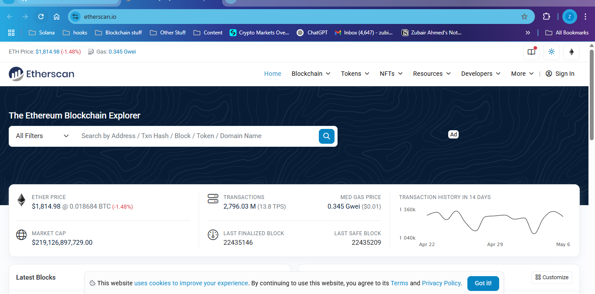

Take a minute to identify key elements on the homepage:
- The search bar at the top (for looking up addresses, transactions, or blocks)
- Latest blocks and transactions in the center
- Current gas prices and network activity metrics

### Step 2: Exploring Wallet Addresses

Enter this example wallet address in the search bar: `0xd8dA6BF26964aF9D7eEd9e03E53415D37aA96045` (This belongs to Vitalik Buterin, Ethereum co-founder)

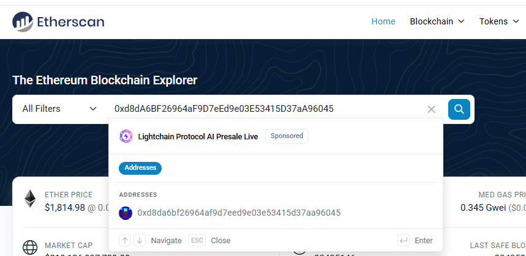

When you view a wallet address, you'll see comprehensive information about its activity:

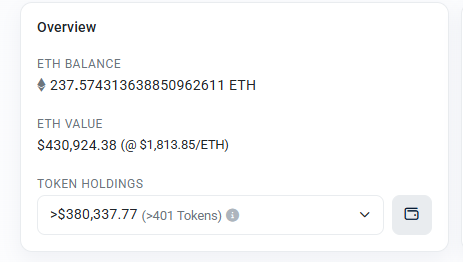

You can see:
- The ETH balance in this wallet
- Value of tokens held (ERC-20 tokens)
- NFTs owned (ERC-721 tokens)
- Transaction history

Click the "Transactions" tab to see all transactions associated with this address:

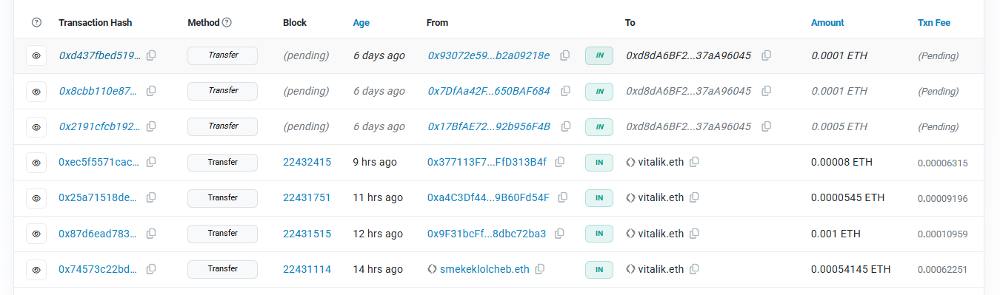

Each transaction shows important details like:
- Transaction hash (a unique identifier)
- The block it was included in
- When it happened
- Sender and recipient addresses
- Amount transferred
- Transaction fee paid

### Step 3: Analyzing Transaction Details

Click on any transaction hash to see a detailed breakdown:

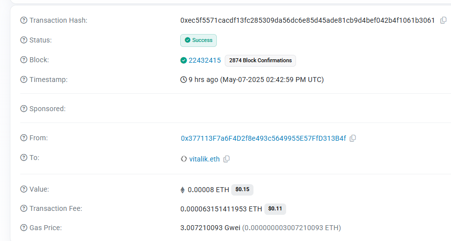

This view provides detailed information about:
- Transaction status (Success/Failed)
- Block confirmation count
- Gas used and gas price
- Total transaction cost
- Input data (the actual information sent to the blockchain)

Pay attention to the difference between simple ETH transfers (minimal input data) and smart contract interactions (which contain encoded function calls).

### Step 4: Decoding Transaction Input Data

When looking at a transaction with a smart contract interaction, scroll to the "Input Data" section:

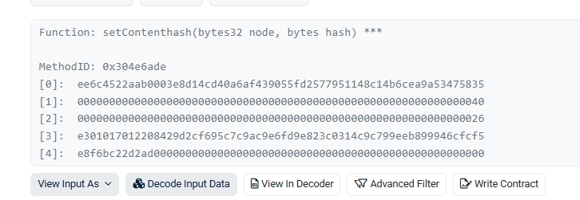

The "Decode Input Data" option converts the raw hexadecimal data into readable information showing:
- The function that was called
- Parameters that were passed to the function
- What the transaction was actually doing (swap, transfer, etc.)

This is valuable for understanding exactly what happened in complex transactions.

### Step 5: Exploring Smart Contracts

Enter this contract address in the search bar: `0x6B175474E89094C44Da98b954EedeAC495271d0F` (DAI stablecoin)

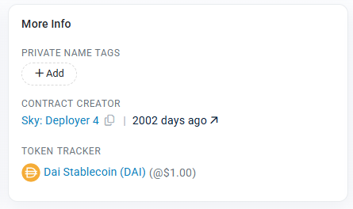

The contract page shows:
- Who created the contract
- When it was deployed
- Current balance
- Token information and statistics

Click on the "Contract" tab to explore its code:

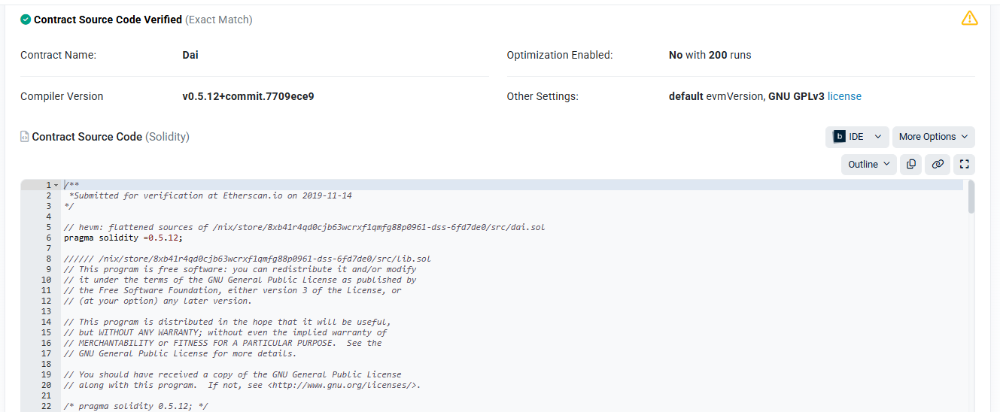

A verified contract will show its source code, making it transparent and auditable.

You can also see:
- Contract ABI (Application Binary Interface) - how to interact with the contract
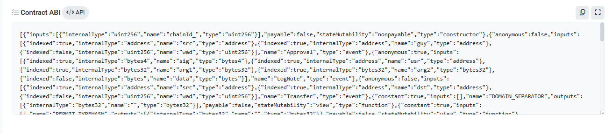

- Contract Creation Code - the bytecode that created the contract
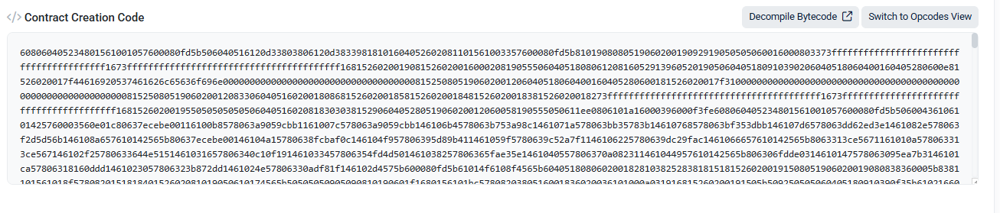

### Step 6: Understanding Verified Contracts

Verified contracts are important for security and transparency in DeFi. When a contract is verified:

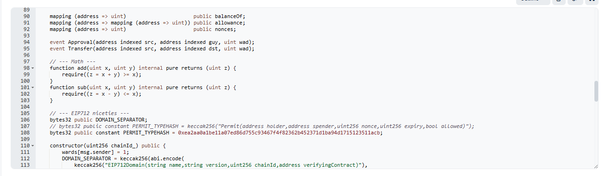

- Anyone can read the actual code
- Developers and auditors can confirm it works as intended
- Users can verify that functions do what they claim

Unverified contracts should be approached with caution as you can't see what the code actually does.

### Step 7: Using Gas Tracker and Network Analytics

Return to the Etherscan homepage and find the "Gas Tracker" section in the More menu:

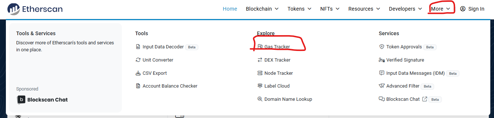

The Gas Tracker shows current gas prices for different transaction speeds:

- Low: cheaper but slower confirmation
- Average: standard price/time balance
- High: faster but more expensive

This helps you decide how much to pay for your own transactions based on urgency.

Explore the "Charts & Stats" section for detailed metrics about the Ethereum network:

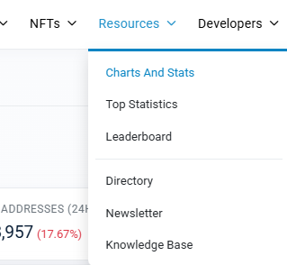

These analytics show trends in gas prices, network usage, transaction volume, and more - useful for understanding network activity patterns.

### Step 8: Exploring Block Details

Click on any block number from the homepage:

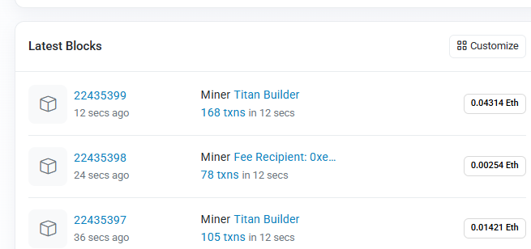

The block page shows everything about that block:

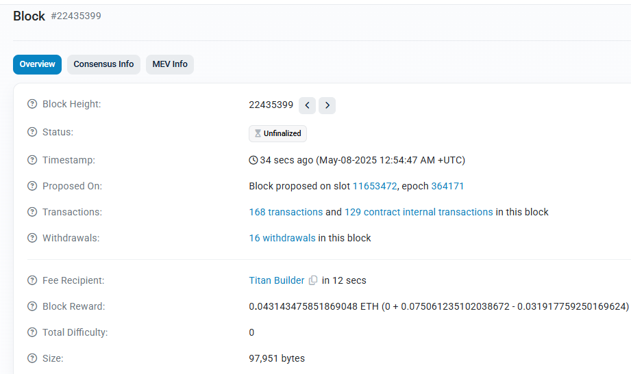
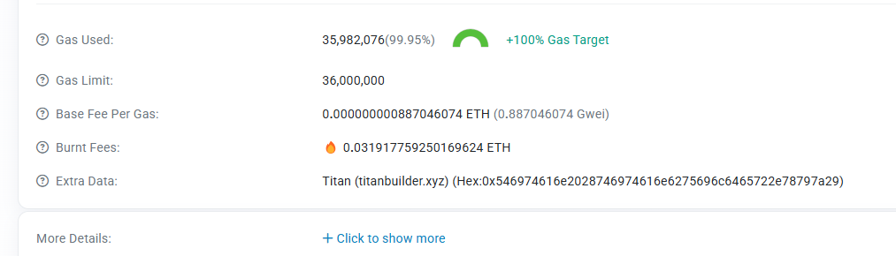

Key information includes:
- When the block was created
- Which validator/miner produced it
- Rewards paid
- Number of transactions included
- Gas used compared to the limit

You can also see all transactions that were included in this block:

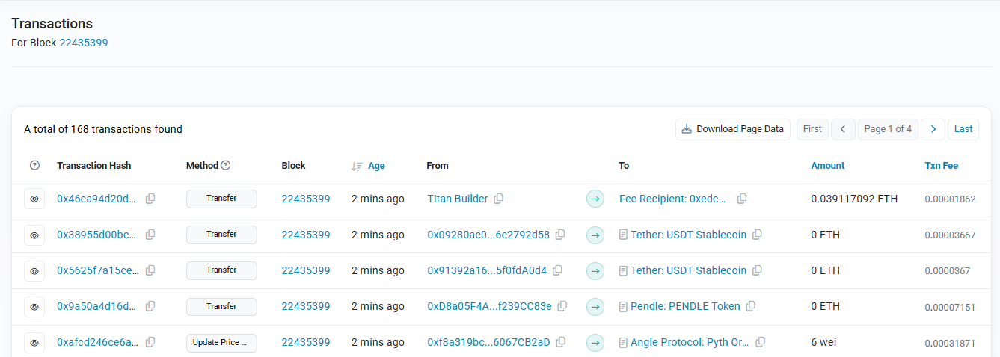

### Step 9: Using Advanced Features

Etherscan offers additional tools that are useful for DeFi users:

Token Approval Checker - see what contracts have permission to spend your tokens:

ENS Lookup - translate between human-readable names and Ethereum addresses:
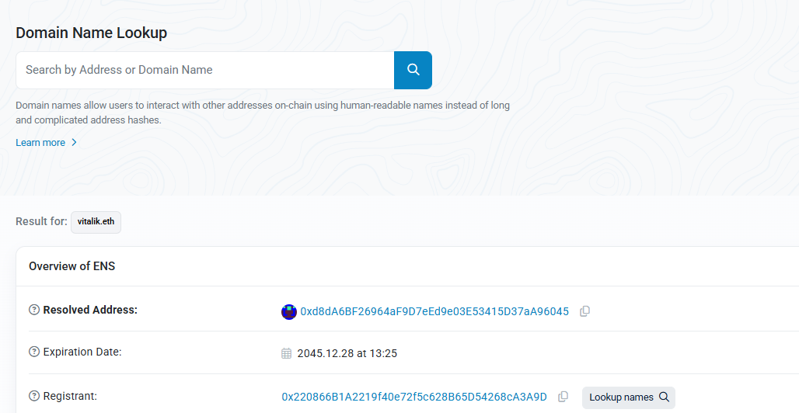

You can also explore different Ethereum networks using the network selector:
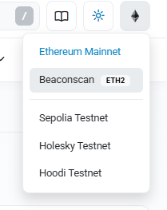

These include test networks (like Sepolia or Goerli) and the main Ethereum network.

## Challenge Tasks
Try these activities to test your understanding:

1. Find a transaction that involves a token swap on a decentralized exchange
2. Locate a contract deployment transaction and analyze its gas costs
3. Identify a failed transaction and determine why it failed
4. Track the flow of funds across multiple transactions from a single address

## Conclusion
You've now learned how to use Etherscan to explore the Ethereum blockchain. These skills are essential for DeFi users who need to verify transactions, check smart contracts, monitor wallet activity, and understand network conditions.

## Additional Resources
- [Etherscan Knowledge Base](https://info.etherscan.com/)
- [Ethereum Transaction Lifecycle](https://ethereum.org/en/developers/docs/transactions/)
- [Understanding Ethereum Smart Contracts](https://ethereum.org/en/developers/docs/smart-contracts/) 