# Practical DeFi Lab 2: Connecting to DeFi Platforms

## Overview
In this lab, you'll learn how to safely connect your wallet to various DeFi platforms. We'll explore wallet setup, connection processes, security considerations, and permission management - all essential skills for interacting with decentralized applications securely.

## Prerequisites
- A computer with internet access
- A web browser (Chrome, Firefox, or Brave recommended)

## Steps

### Step 1: Installing a Web3 Wallet
For this lab, we'll use MetaMask as our Web3 wallet. MetaMask is a browser extension that allows you to interact with the Ethereum blockchain and DeFi applications.

1. Visit the [MetaMask website](https://metamask.io/download/)
2. Click "Install MetaMask for [Your Browser]"

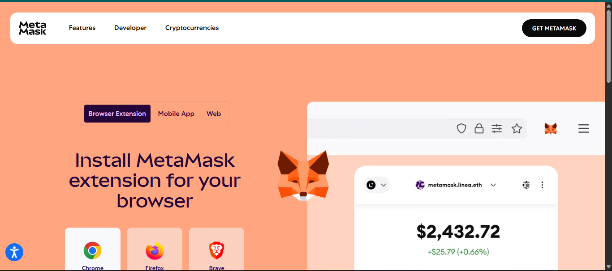

3. Follow the installation prompts to add the extension to your browser
4. Once installed, you'll see the MetaMask fox icon in your browser extensions

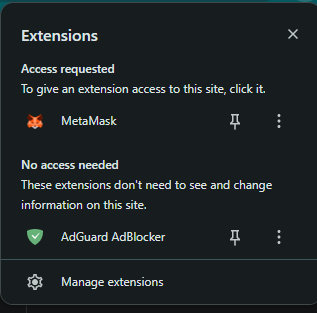

### Step 2: Setting Up Your Wallet

1. Click on the MetaMask icon in your browser to open it
2. Click "Get Started" to begin the setup process
3. You'll be given two options:
   - Import an existing wallet (if you already have a seed phrase)
   - Create a new wallet (for first-time users)

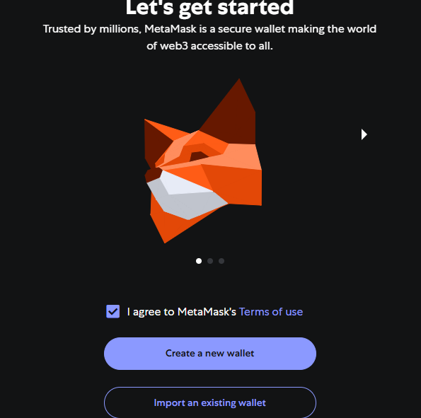

4. For this lab, select "Create a new wallet"
5. Create a strong password when prompted
6. You'll be shown a 12-word recovery phrase (seed phrase) - this is EXTREMELY important!

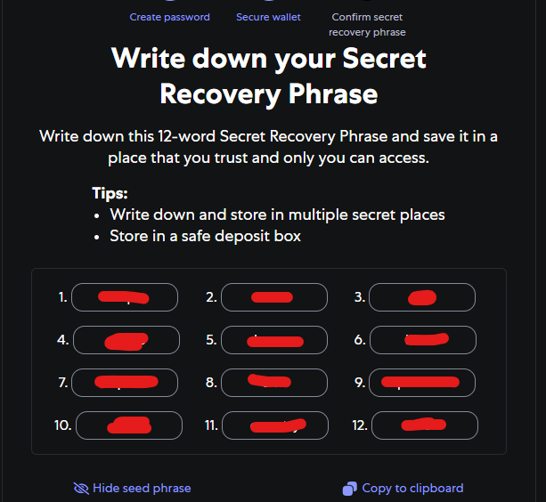

**Critical Security Note:** Never share your seed phrase with anyone. Write it down on paper and store it in a secure location. Never store it digitally or take screenshots of it. Anyone with this phrase can access all your funds.

7. Verify your seed phrase by selecting the words in the correct order
8. After confirmation, your wallet is ready to use

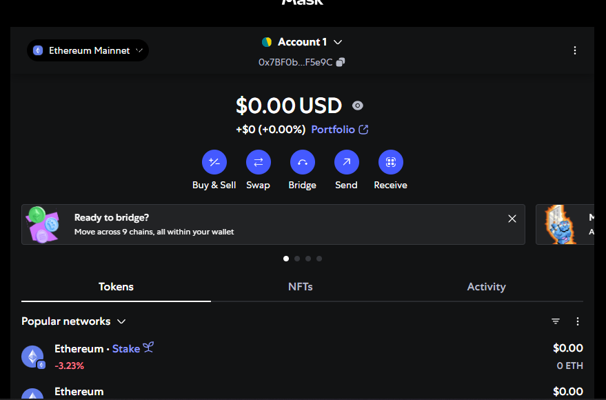

### Step 3: Understanding Wallet Networks

MetaMask allows you to connect to different Ethereum-compatible networks:

1. Click on the network dropdown at the top of the MetaMask window
2. You'll see several options:
   - Ethereum Mainnet (the main Ethereum network)
   - Test networks (Sepolia, Goerli)
   - Custom networks you can add manually

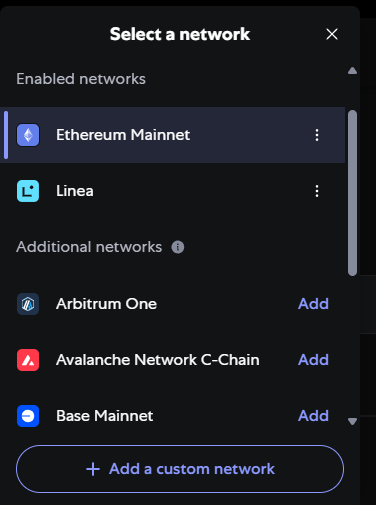

For this lab, we'll use the Ethereum Mainnet. However, for practicing transactions without spending real ETH, you might want to use a test network later.

### Step 4: Connecting to a DeFi Platform

Now let's connect to a popular DeFi platform. We'll use Uniswap as an example:

1. Visit [Uniswap](https://app.uniswap.org/)
2. In the top-right corner, click "Connect Wallet"

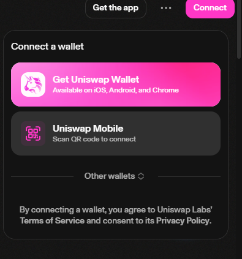

3. Select MetaMask from the list of available wallets

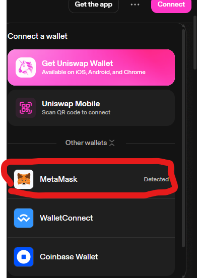

4. Your MetaMask extension will open and ask for permission to connect to Uniswap
5. Review the connection request and click "Connect"

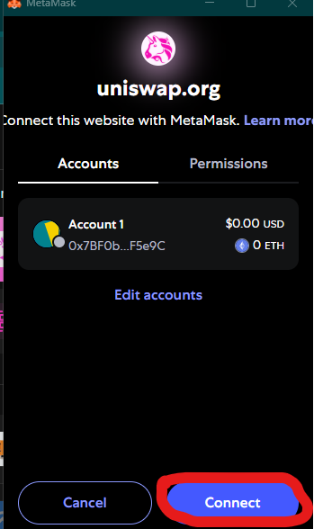

6. Once connected, you'll see your wallet address displayed in the Uniswap interface

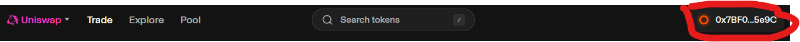

### Step 5: Understanding Connection Permissions

When you connect your wallet to a DeFi platform, you're only giving it permission to:
- See your wallet address
- See your account balance
- Request transactions (which you must approve individually)

You are NOT giving the platform:
- Access to your private keys
- Permission to move funds without your approval
- Access to other accounts or wallets you own

### Step 6: Reviewing Connection Requests

When interacting with DeFi platforms, you'll encounter various connection and permission requests:

1. Standard Site Connection - The basic permission to view your address and propose transactions

2. Transaction Approval - When you want to perform an action that changes blockchain state (like swapping tokens)

Before approving any transaction:
- Verify the website URL (beware of phishing sites)
- Check transaction details (amounts, addresses, gas fees)
- Understand what the transaction will do

### Step 7: Token Approvals and Permissions

Many DeFi actions require you to approve spending of your tokens:

1. When first interacting with a token on a platform, you'll need to "approve" it to spend that token
2. This is a separate transaction from the actual swap or deposit

**Security Note:** Be cautious with unlimited approvals. Consider:
- Approving only the amount you need for a specific transaction
- Using tools like [Revoke.cash](https://revoke.cash/) to manage token approvals
- Regularly checking and revoking unused permissions

### Step 8: Managing Active Connections

You can view and manage sites connected to your MetaMask:

1. Open MetaMask and click the three dots menu
2. Select "All Permissions"

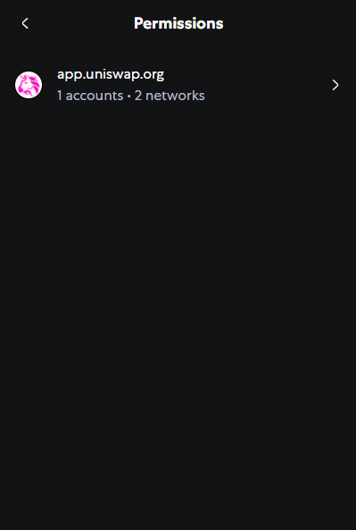

3. You'll see a list of all websites currently connected to your wallet
4. To disconnect a site, click Disconnect

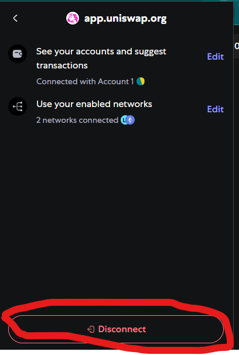

### Step 9: Disconnecting Your Wallet

When you're finished using a DeFi platform, it's a good security practice to disconnect your wallet:

1. On Uniswap, click your address in the top-right corner
2. Select "Disconnect"

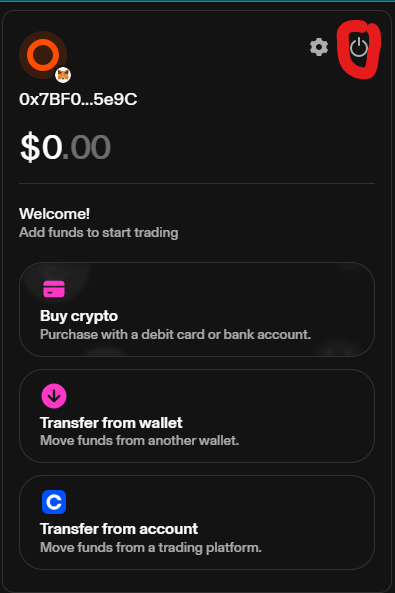

3. The site will no longer have access to view your wallet information
4. You'll need to reconnect when you return to the site

### Step 10: Exploring Different DeFi Platforms

Let's connect to another popular DeFi platform to understand differences in connection flows:

1. Visit [Aave](https://app.aave.com/)
2. Click "Connect Wallet" in the top-right corner
3. Select MetaMask
4. Approve the connection request

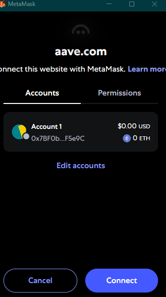

While the basic connection process is similar across platforms, you may notice differences in:
- The UI/UX of connection requests
- Types of permissions requested
- How wallet information is displayed after connection

## Challenge Tasks
Try these activities to test your understanding:

1. Connect your wallet to three different DeFi platforms
2. Compare the connection processes and permissions requested
3. Practice disconnecting from each platform
4. Find where token approvals are managed in your wallet
5. Explore a permissions management tool like Revoke.cash

## Conclusion
You've now learned how to securely connect your wallet to DeFi platforms, understand different permission types, and manage your connections. These skills form the foundation for safely interacting with the DeFi ecosystem.

## Additional Resources
- [MetaMask Security Guide](https://metamask.io/security/)
- [How to Revoke Token Approvals](https://metamask.zendesk.com/hc/en-us/articles/4446106184731-How-to-revoke-smart-contract-allowances-token-approvals)
- [DeFi Security Best Practices](https://consensys.net/blog/metamask/the-seal-of-approval-know-what-youre-consenting-to-with-permissions-and-approvals-in-metamask/) 